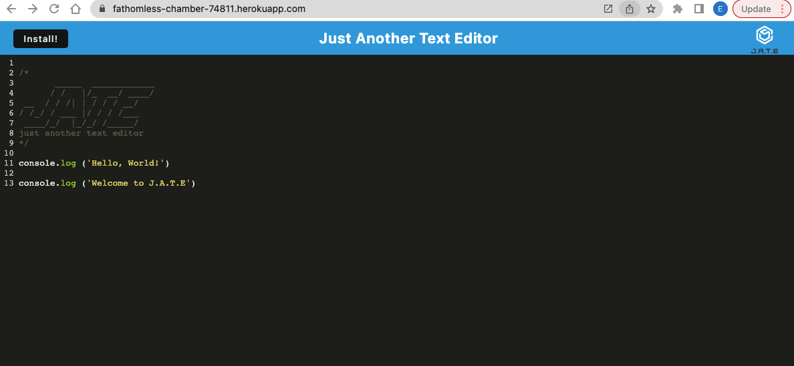
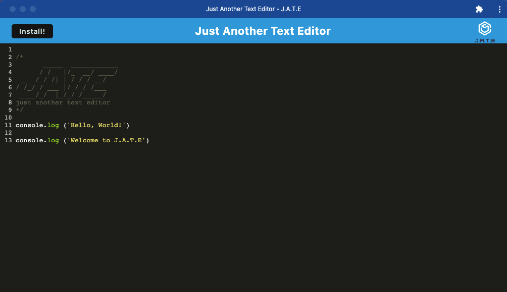
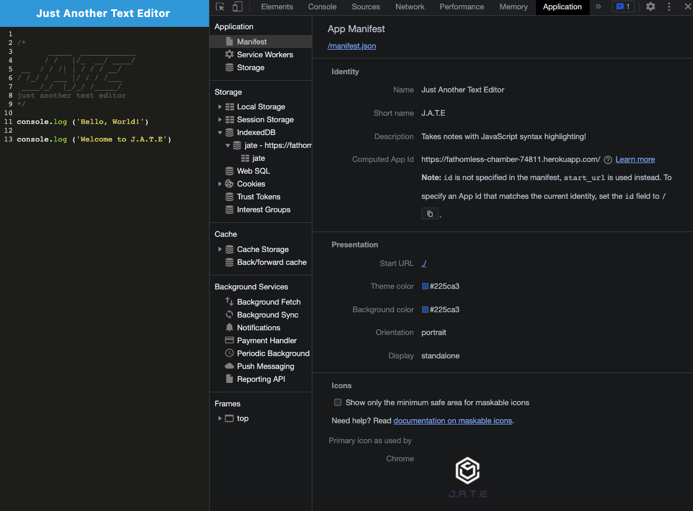
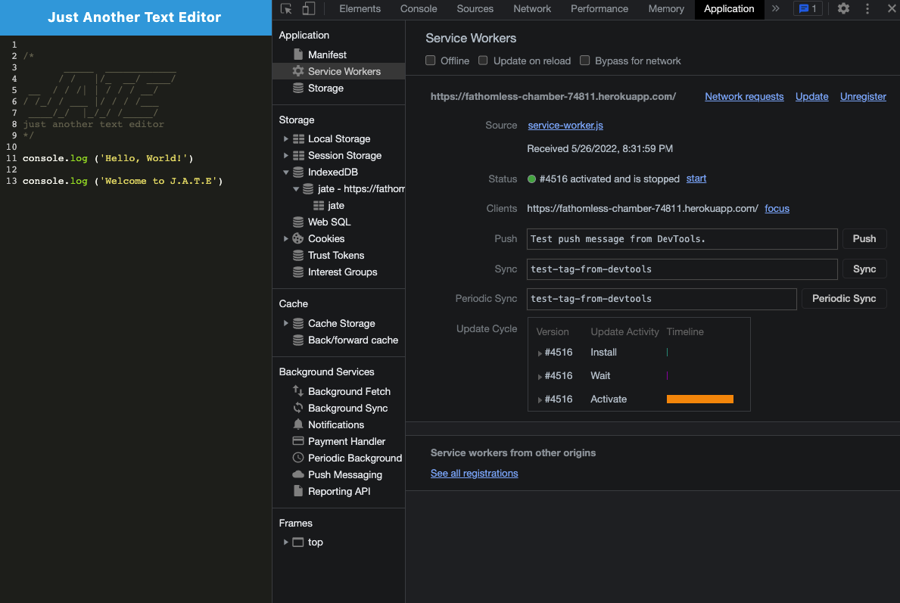
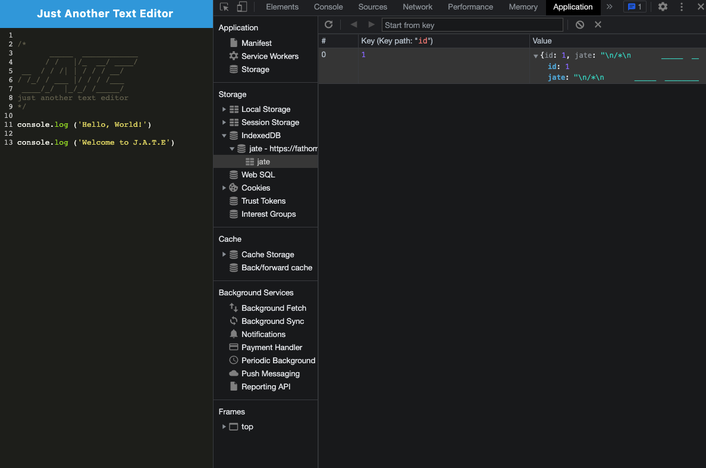

# Just Another Text Editor Project


## Link

**Please click [here](https://fathomless-chamber-74811.herokuapp.com/) to find the deployed application in Heroku**

## Description

The **Just Another Text Editor**, shorten as J.A.T.E, is a web application that helps users to create and save notes or code snippets. Users can type in their notes or code snippets and subsequently click off of the DOM window, then the entered content will be saved in the database. The content will be displayed again after reloading the web application. If desired, users can install it to their local machine and use the application offline.

## Table of Contents

- [Link](#link)
- [Description](#description)
- [Installation](#installation)
- [Usage](#usage)
- [Technologies](#technologies)
- [Credits](#credits)
- [Assets](#assets)
- [License](#license)

## Installation

**For users** - no installation needed, please visit the deployed [application link](https://fathomless-chamber-74811.herokuapp.com/) directly
- Click on the `Install` button to download the application in your local machine in order to use it offline 

**For developers** - use the following commands in root folder
- To install npm packages: `npm i`
- To start the app: `npm start` or `npm run dev`
    - The `dist` folder will be auto-generated
- To stop the app: `Control+C` then close your terminal

## Usage

Please follow the usage instruction here:
- Open the application from the Heroku deployed link
- Type in your notes in the application
- The notes will be saved in the database when clicking off of the DOM window
- Your notes will be displayed again after re-opening the application
- Click on the `Install` button, the application will be downloaded in your local machine - the application will also function offline

## Technologies

```md
JavaScript
HTML
CSS
Express.js
IndexedDB
```

## Credits

The starter code is provided by The Coding Boot Camp | UC San Diego Extension | Trilogy Education Services, LLC

## Assets

The following images demonstrate the **Just Another Text Editor** application's functionality:

J.A.T.E online:



J.A.T.E offline:



`manifest.json` file:



Registered service worker:



IndexedDB storage:



## License

Copyright (c) 2022 Elaine Qiling Deng. This project is licensed under the terms of the [MIT license](LICENSE).